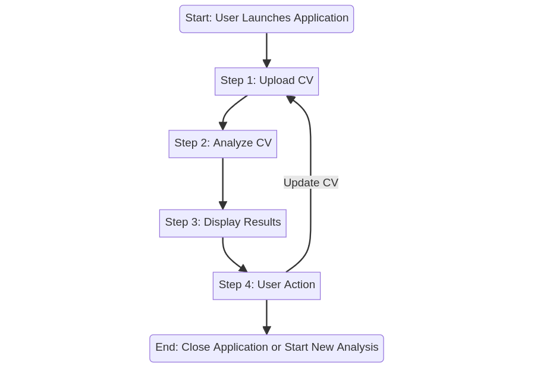

# PDF-CV App 📄

This PDF-CV app allows users to create high-quality, customized professional CVs in PDF format. It offers a user-friendly interface and a variety of templates to choose from.

# TO DO

´
npm install --save-exact --save-dev esbuild --loader:.js=jsx

npm install react react-dom

npm run build
´

## Purpose 🎯

**How does the app work?**

- **Upload Your CV** 📤:
  - Navigate to the 'Upload Your CV' section on the main screen.
  - Select your CV's PDF file from your device.
  - Confirm the upload.

- **Analysis and Results** 🔍:
  - Once uploaded, the app automatically begins analyzing your CV.
  - During this, an animation displays to show that analysis is underway.
  - Wait for the results to be displayed.

- **Quality Star Rating** ⭐:
  - At the end of the analysis, your CV will receive a quality rating in stars.
  - 5 stars indicate a top-quality CV that meets market expectations.
  - Fewer stars suggest areas for improvement.

- **CV Improvement Tips** 💡:
  - Personalized recommendations will be provided based on the analysis.
  - Follow these tips to enhance the quality of your CV.

- **Technical Support** 🛠️:
  - For any issues or additional questions, contact technical support through the app or by email at <contact@kvnbbg.fr>.

## Features 🌟

- **Emojis for Enhanced Readability:** 😊 Enabled
- **Programming Paradigm:** 🧠 Object-Oriented
- **Development Language:** 🌐 React
- **Project Focus:** 📚 Web Development
- **Comments:** 📖 Descriptive and Insightful
- **Code Structure:** 🛠️ Modular and Clean
- **Error Handling:** 🚫 Comprehensive and Robust

## Project Management Tools 🛠️

- **Trello Board:** Monitor our project's milestones and tasks via our [Trello board](https://trello.com/b/A91KBkFf/kvnbbg-pdf-cv).
- **GitHub Repository:** Access our source code and resources on [GitHub](https://github.com/Kvnbbg/pdf-cv).
- **Live Application:** Experience the web application [here](https://pdf-cv-c8a60c902f01.herokuapp.com/).

## Table of Contents 📑

- [Installation](#installation)
- [Usage](#usage)
- [Contributing](#contributing)
- [License](#license)

## Installation

To install the PDF-CV app, follow these steps:

1. Clone the repository: `git clone https://github.com/Kvnbbg/pdf-cv.git`
2. Navigate to the project directory: `cd pdf-cv`
3. Install the dependencies: `npm install`

## Usage

To use the PDF-CV app, follow these steps:

1. Start the app: `npm start`
2. Open your web browser and navigate to `http://localhost:3000`
3. Upload your CV and explore the features.

## Contributing

We welcome contributions from the community to enhance the PDF-CV app. To contribute, please follow these steps:

1. Fork the repository.
2. Create a new branch: `git checkout -b feature/your-feature-name`
3. Make your changes and commit them: `git commit -m 'Add some amazing feature'`
4. Push to the branch: `git push origin feature/your-feature-name`
5. Submit a pull request.

## License

The PDF-CV app is distributed under the [Mozilla Public License Version 2.0](https://opensource.org/licenses/MPL-2.0). See the [LICENSE](LICENSE) file for more information.

## STUDI Folder 📁

The STUDI folder contains helpful resources for exam preparation, including:

- **Study Guide:** STUDI/manuel_utilisateur.pdf
- **Reference Materials:** STUDI/devis.pdf
- **Flowcharts & Diagrams:** 
