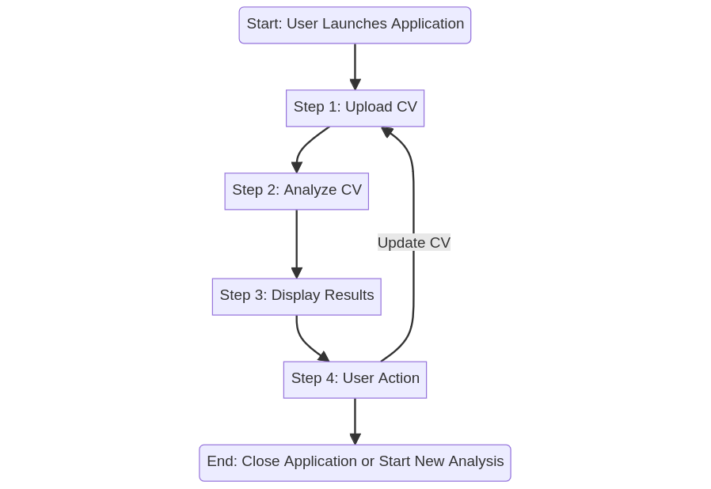

# PDF-CV App 📁

## Grimoire des Contenus 📑

- [Installation](#installation)
- [Usage](#usage)
- [Contributing](#contributing)
- [License](#license)
- [Trello STUDI](#studi)

## Installation

- **STUDI Trello:** Monitor our project's milestones and tasks via our [STUDI Trello](https://trello.com/b/A91KBkFf/kvnbbg-pdf-cv).
- **GitHub Repository:** Access our source code and resources on [GitHub](https://github.com/Kvnbbg/pdf-cv).
- **ONLINE** Experience the web application [here](https://kvnbbg.github.io/pdf-cv/).
- [LIVE](https://techandstream.com).**ON Streams**

To install the PDF-CV app, follow these steps:

1. Clone the repository: `git clone https://github.com/Kvnbbg/pdf-cv.git`
2. Navigate to the project directory: `cd pdf-cv`
3. Install the dependencies: `npm install`

## Usage

To use the PDF-CV app, follow these steps:

1. Start the app: `npm start`
2. Open your web browser and navigate to `http://localhost:3000`
3. Upload your CV and explore the features.

## Contributing

We welcome contributions from the community to enhance the PDF-CV app. To contribute, please follow these steps:

1. Fork the repository.
2. Create a new branch: `git checkout -b feature/your-feature-name`
3. Make your changes and commit them: `git commit -m 'Add some amazing feature'`
4. Push to the branch: `git push origin feature/your-feature-name`
5. Submit a pull request.

## License

The PDF-CV app is distributed under the [Mozilla Public License Version 2.0](https://opensource.org/licenses/MPL-2.0). See the [LICENSE](LICENSE) file for more information.

## Studi

Sam pulled up a monitoring dashboard that looked like a Jackson Pollock painting rendered in neon red. "Explaining how the app works is easy. Proving *why* it crashes at 2 AM is our actual nightmare. We need a rigorous strategy for measuring our back-end pain points before the entire cluster melts."

Alex leaned in, tracing a massive latency spike on the monitor. "Exactly. The GraphQL layer is masking our real issues. A front-end developer requests a deeply nested object, and suddenly our PostgreSQL database is doing an unindexed table scan. We aren't measuring the query depth, so the resolvers just choke quietly."

"And don't get me started on the message broker," Sam added, tapping the glass. "If the legacy SOAP gateway times out, RabbitMQ just keeps eating inbound requests. We only find out we have a problem when the queue depth hits critical mass, the memory maxes out, and the worker nodes start dropping like flies."

Morgan sighed, rubbing their temples. "I don't speak Grafana, Sam. To the board, a 'back-end pain point' is a customer abandoning their checkout because the loading spinner timed out. If you want the budget for better observability tools, you have to translate these server metrics into business realities. CPU saturation means nothing to me; user churn rate means everything."

Zane looked up from a Discord server, eyes wide. "If we just minted our server logs as NFTs, the community would audit our smart contracts for free. The real pain point is centralized telemetry. If a node goes down, we just slash the validator's staked tokens!"

Alex closed their eyes, taking a deep, stabilizing breath before outlining the actual observability strategy on the whiteboard.

**Core Telemetry & Bottleneck Detection**

* **Consumer Lag & Queue Depth:** Monitoring RabbitMQ to track if messages are accumulating faster than worker nodes can process them. A growing queue is the earliest indicator of a blocked downstream service or a failing SOAP endpoint.
* **Query Profiling & Deadlocks:** Analyzing PostgreSQL slow query logs and connection pool saturation. This exposes poorly optimized GraphQL resolvers before they lock up the relational database.
* **Endpoint Latency & Error Rates:** Tracking the exact round-trip time for inbound REST and GraphQL requests, isolating HTTP 5xx errors and cascading timeouts to pinpoint exactly where the transaction pipeline is bleeding.
* **Infrastructure Saturation:** Correlating CPU, memory, and network I/O spikes on the worker nodes with specific API payloads to predict precisely when the system requires auto-scaling.
